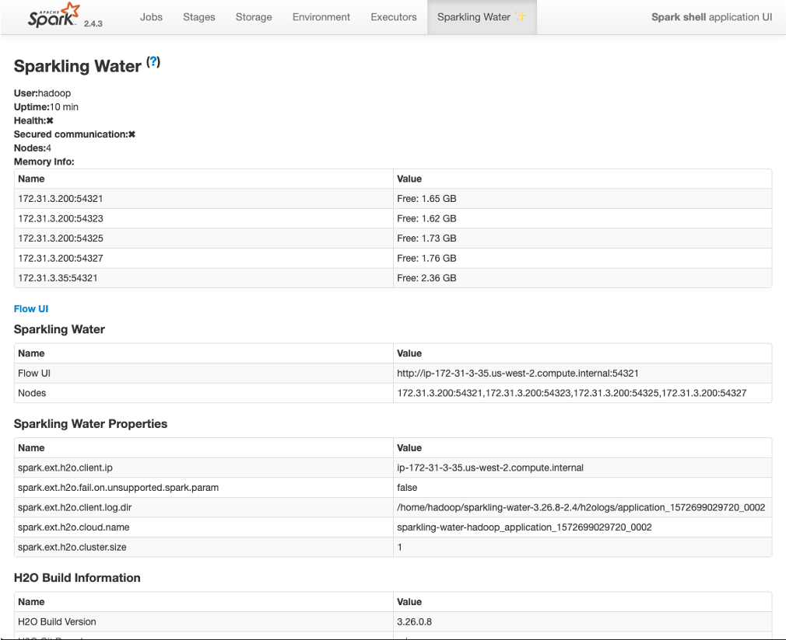

# 使用EMR + H2O构建AI/ML应用

**为EMR装上AI的翅膀**

这个技术方案的背景源于一个真实的项目需求，客户打算在国内开发一个AI/ML应用，用于进行业务的创建，为终端用户提供更高的商业价值与服务。在项目前期对技术需求进行了梳理，主要包括在：

1). 数据集全部来源于互联网和第三方合作伙伴，并且需要进行大量的清洗和特征工程工作

2). 数据集除用于模型训练外，还需要加载至数据仓库，用于分析

3). 希望有一个包含从算法、训练和预测的AI框架，简化开发和管理工作

4). 希望模型训练部分能与大数据处理相结合，最好能够在同一平台上实现

按照以上的需求，在技术选型方面采用了如下方案：

数据存储：Amazon S3, 将外部数据全部存储至S3, 作为数据湖中的源数据，以供后续的处理

数据处理：AWS EMR，主要利用Spark来高效地处理S3上的源数据，实现数据的清洗和特征工程

数据仓库：采用了EMR中的Hive

任务调度：Oozie

可以看出，关于数据处理部分的选型还是相对较容易的，其余主要是AI/ML框架的选择，根据技术需求，最先测试了Spark Mllib与Spark ML, 但结果并没有达到预期，主要体现在：Mllib主要针对RDD进行操作，目前已经很少进行更新，支持的模型和精度都不是很理想，特别是对XGBoost的支持。并且预测环境较重，同时需要运行于Spark环境当中。

后来根据以前的项目经历，找到了H2O.AI，我们选择了他提供的Sparkling Water框架进行测试，可支持的算法较丰富，支持AutoML, 能与Spark进行无缝集成等功能。随后对该框架进行了POC测试，经过验证，完全能够满足项目的需求，且预测实现简单，将模型导出POJO/MOJO类库，在生产环境中调用即可。


制订的项目架构图如下：


关于H2O.AI

主要的产品：


其中就包括我们所使用的Sparkling Water框架，这里简单归纳一下他的主要功能：

- Open source, distributed AI framework
- Algorithms: XGBoost, Random Forest, GLM, GBM, GLRM…
- Languages and Tools: R, Python, Scala, Flow and Web UI.
- Simple Deployment: POJO or MOJO
  - MOJO: 适用于复杂模型，例如gbm, xgboost, ensamble model 等，需要依赖模型生成的文件。
  - POJO: 适用于分类和回归模型，以Java class的形式调用，不能超过1G，较简单的模型比mojo速度快。

- AutoML
- In-Memory Processing

项目中的关键——能够与EMR和Spark的集成功能：

- 与EMR生态系统完全透明集成
- 在EMR中使用H2O数据结构和算法，可通过Spark API进行调用
- 对于数据处理，可以在Spark dataframes和H2O Frames之间相互转换
- 支持LDAP and Kerberos身份认证
- 原生支持Amazon S3
- 支持的数据格式：CSV, Parquet, ORC, SVMlight, ARFF

Sparkling Water的数据处理过程：


使用EMR Spark进行数据的处理 -> 由Sparkling Water进行模型训练 ->在EMR环境中进行预测，也可导出类库在Java应用程序中实现预测

他的工作原理：


可以看出Sparkling Water是在原Hadoop的基础上进行了封装，具备与Spark应用程序相同的架构，当启动一个应用时，会创建一个新的H2O driver, 还可以通过其自带的UI界面进行可视化操作。在进行模型训练时，会通过YARN Resource Manager来分配节点资源，并将Job运行于Spark executor中。


Sparkling Water on EMR调用方法：

1. Sparkling Shell

   类似使用Spark Shell的使用方式，指定executor数量，内存分配，driver运行模式即可。

   ```
   $> export HADOOP_CONF_DIR, SPARK_HOME, MASTER(可以是Yarn, Standalone..)
   $> bin/sparkling-shell --num-executors 1 --executor-memory 2g --master yarn --deploy-mode client --conf "spark.ext.h2o.fail.on.unsupported.spark.param=false"
   Scala> import org.apache.spark.h2o._
   Scala> val h2oContext = H2OContext.getOrCreate(spark)
   Scala> import h2oContext._
   
   ```

   注：当前与EMR Spark “DynamicAllocation”参数不兼容，需要用此参数忽略不兼容项目--conf "spark.ext.h2o.fail.on.unsupported.spark.param=false"


可以使用自带的UI来进行一部分操作和AutoML的训练


运行一个AutoML:


2. Coding, traing your model，我们主流的使用方式（以Scala语言为例）

**Spark DataFrame 与H2O Frame的互转**

```
val hf: H2OFrame = df
val df = asDataFrame(h2oFrame)
```

**直接从S3加载数据**

```
// 需要安装aws sdk, aws-hadoop.jar包，并配置S3A使用AWS Acesskey访问
import java.net.URI
val fr = new H2OFrame(new URI("s3a://bucket/data.csv"))
/*
数据处理逻辑代码
*/

```

**通过代码来训练模型**

```
import ai.h2o.sparkling.ml.algos.H2OXGBoost
val hc = H2OContext.getOrCreate(spark)
val frame = new H2OFrame(new URI("s3a://bucket/data.csv"))
val sparkDF = hc.asDataFrame(frame).withColumn("CAPSULE", $"CAPSULE" cast "string")
val Array(trainingDF, testingDF) = sparkDF.randomSplit(Array(0.8, 0.2))
val estimator = new H2OXGBoost().setLabelCol("CAPSULE")
val model = estimator.fit(trainingDF)
model.getModelDetails()
model.transform(testingDF).show(false). //Run predictions

```

**将模型导出为MOJO/POJO**

```
ModelSerializationSupport.exportMOJOModel()/exportPOJOModel()
```

3. 使用Spark Package形式，通过Spark Sumit命令提交

```
bin/spark-submit --packages ai.h2o:sparkling-water-package_2.11:3.26.10-2.4 --class org.your.product.examples.ExampleApp /dev/null
$> bin/spark-shell --packages ai.h2o:sparkling-water-package_2.11:3.26.10-2.4
For Python:
$> bin/spark-submit --packages ai.h2o:sparkling-water-package_2.11:3.26.10-2.4 example.py
```


**关于监控与调优**

可采用与Spark同样的方式对性能进行监控，如：Spark UI, History Server。此外Sparkly Water也提供了自已的Spark Shell Application UI，用于查看所有的配置和运行时信息。



参数优化：

可通过参数配置对Sparkling Water进行调整，具体可配置的参数可参考：http://docs.h2o.ai/sparkling-water/2.4/latest-stable/doc/configuration/configuration_properties.html

POC测试所使用的示例参见pocs目录。